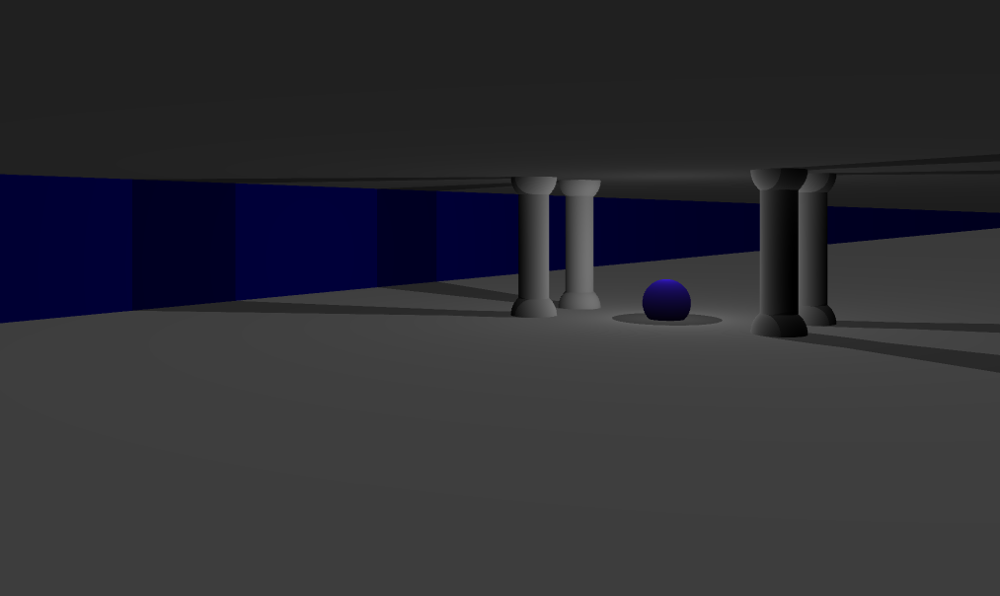
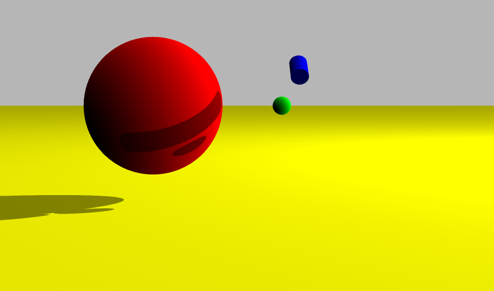
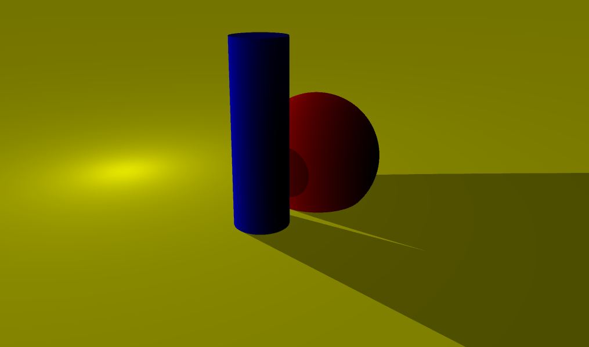

# MiniRT
<h3>Summary</h3>
<p>This project is an introduction to the beautiful world of Raytracing.
Once completed you will be able to render simple Computer-Generated-Images and you
will never be afraid of implementing mathematical formulas again.</p>

<div style="max-width: 100%; overflow: hidden;">
  
  
  
</div>

# Description

<h3>What is <b>Raytracing?</b></h3>
<p>When it comes to rendering 3-dimensional computer-generated images there are 2 possible approaches:<b>“Rasterization”</b>, which is used by almost all graphic engines because of its efficiency and <b>“Ray Tracing.”</b> The <b>“Ray Tracing”</b> method, developed for the first time in 1968 (but improved upon since) is even today more expensive in computation than the <b>“Rasterization”</b> method. As a result, it is not yet fully adapted to real time use-cases but it produce a much higher degree of visual realism.</p>

<h3>Objective</h3>
<p>Create a simple raytracing engine.</p>
<ul>
  <li>It must handle 3 shapes (planes, shperes and cylinders).</li>
  <li>All possible intersections and the inside of the object must be handeled correctly.</li>
  <li>The program must be able to resize the object’s unique properties: diameter for a sphere and the width and height for a cylinder.</li>
  <li>The program must be able to apply translation and rotation transformation to objects, lights and cameras.</li>
  <li>Light management: spot brightness, hard shadows, ambiance lighting (objects are never completely in the dark). Ambient and diffuse lighting must be implemented</li>
</ul>

# Install and Run
<sub><i>(tested on Ubuntu)</i></sub>

```bash
git clone https://github.com/VulpesDev/MiniRT ~/miniRT_Vulpes && cd ~/miniRT_Vulpes && git submodule update --init --recursive && make && echo && echo && ./miniRT scenes/temple.rt
```

# Usage

Just run the executable with the scene directory "./miniRT <scene directry>"

```bash
./miniRT scenes/temple.rt
```

# ".rt" files

  <b>Overview</b>
  <ul>
    <li>Each type of element can be separated by one or more line break(s).</li>
    <li>Each type of information from an element can be separated by one or more space(s).</li>
    <li>Each type of element can be set in any order in the file.</li>
    <li>Elements which are defined by a capital letter can only be declared once in the scene.</li>
  </ul>
  <br><br><br>
<ul>
  <li>Ambient lightning:</li>
  <ul>
    <li>identifier: A</li>
    <li>ambient lighting ratio in range [0.0,1.0]</li>
    <li>R,G,B colors in range [0-255]</li>
  </ul>
  <li>Camera:</li>
  <ul>
    <li>identifier: C</li>
    <li>x,y,z coordinates of the view point</li>
    <li>3d normalized orientation vector. In range [-1,1] for each x,y,z axis</li>
    <li>FOV: Horizontal field of view in degrees [0-180]</li>
  </ul>
  <li>Light</li>
  <ul>
    <li>identifier: L</li>
    <li> x,y,z coordinates of the light point</li>
    <li>the light brightness ratio [0.0-1.0]</li>
    <li>R,G,B colors [0-255]</li>
  </ul>
  <li>Sphere</li>
  <ul>
    <li>identifier:sp</li>
    <li>x,y,z coordinates of the sphere center</li>
    <li>the sphere diameter</li>
    <li>R,G,B colors [0-255]</li>
  </ul>
  <li>Plane</li>
  <ul>
    <li>identifier: pl</li>
    <li>x,y,z coordinates of a point in the plane</li>
    <li>3d normalized normal vector. In range [-1,1] for each x,y,z axis</li>
    <li>R,G,B colors [0-255]</li>
  </ul>
  <li>Cylinder</li>
  <ul>
    <li>identifier: cy</li>
    <li>x,y,z coordinates of the center of the cylinder</li>
    <li>3d normalized vector of axis of cylinder. In range [-1,1] for each x,y,z axis</li>
    <li>the cylinder diameter</li>
    <li>the cylinder height</li>
    <li>R,G,B colors [0-255]</li>
  </ul>
  <li>Example</li>
  
  ```
A 0.2 255,255,255

C -50,0,20 0,0,0 70
L -40,0,30 0.7 255,255,255

pl 0,0,0 0,1.0,0 255,0,225
sp 0,0,20 20 255,0,0
cy 50.0,0.0,20.6 0,0,1.0 14.2 21.42 10,0,255
  ```
</ul>

